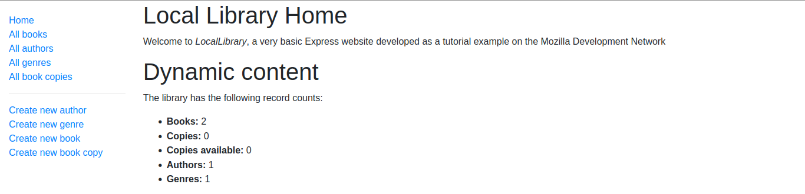

# Readme
# Express Local Library

## Overview

This is my implementation of the Express Local Library project, which was a tutorial
made by the Mozilla Developer Network and also part of the Odin Project Curriculum
for Node.js.  I followed the tutorial but did make some modifications, such as 
using EJS instead of Pug, which was used in the tutorial.  I like to "loosely" 
follow tutorials since it ensures that I am critically-thinking at more moments
during the learning process and not simply copying code!  I specifically chose
EJS because I prefered to have a more HTML-like templating syntax than not.

### Challenge

The tutorial can be found [here](https://developer.mozilla.org/en-US/docs/Learn/Server-side/Express_Nodejs/Tutorial_local_library_website).

### Screenshot

  

### Links

- [Live site](https://glacial-beyond-81568.herokuapp.com/catalog)
- [Repo](https://github.com/mattdimicelli/express-locallibrary-tutorial)

## My process

### Built with

- Node.js
- Express
- EJS
- async module
- Middleware such as Helmet, luxon, http-errors, morgan, and more

### What I learned

- How to use the Express Application Generator tool to create a skeleton website
and application
- How to start and stop the Node web server
- To use MongoDB to store the app's data
- To utilize Mongoose to interact with MongoDB, as opposed to using MongoDB's
native query language
- How to create routes for requesting different information, and to template with
EJS via "views" and "partial-views" to render the data as HTML to be displayed 
in the browser
- The details of working with forms (ex. validation, sanitization, etc)
- How to deploy the app to production using Heroku